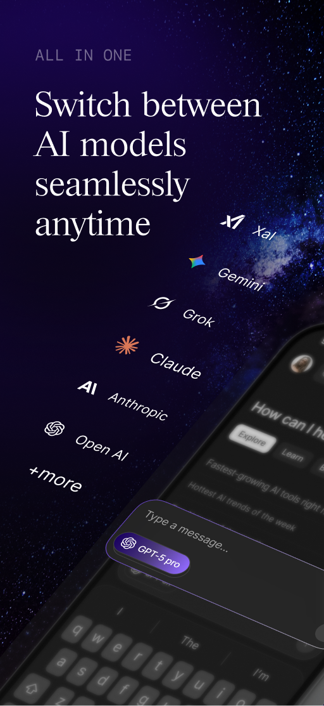

<!-- _class: lead -->
<!-- _paginate: false -->

# Advanced Android

## From Code to Production

---

This course takes you beyond the basics and turns you into a **well-rounded, production-ready Android developer**.

Whether you're an intermediate developer solidifying your foundations or an experienced engineer leveling up — this course covers the full spectrum of modern Android development, from architecture and language mastery to shipping and monetizing real-world apps.

Every topic is approached with a **practical, industry-focused mindset**.

<!--
This comprehensive Android development course is designed to take you beyond the basics and turn you into a well-rounded, production-ready Android developer. Whether you're an intermediate developer looking to solidify your foundations or an experienced engineer aiming to level up your skills, this course covers the full spectrum of modern Android development — from architecture and language mastery to shipping and monetizing real-world applications. Every topic is approached with a practical, industry-focused mindset, ensuring that what you learn directly applies to the apps you build and the teams you work in.
-->

---

This course is built around **Nami** — a unified AI chat app that brings all major LLMs into a single seamless experience.

Rather than isolated examples, every concept is applied directly to a **production-grade codebase** as you build Nami from the ground up.

By the end, you won't just have knowledge — you'll have a **fully functional, shippable application**.

<!--
This course is built around hands-on, practical learning — every concept is taught by applying it directly to a real-world application called Nami, a unified AI chat app that brings all major large language models into a single seamless experience. Rather than isolated examples, you'll see how every topic fits into a production-grade codebase as you build Nami from the ground up. By the end of the course, you won't just have knowledge — you'll have a fully functional, shippable application and the confidence to apply everything you've learned to your own projects.
-->

---

## Course Modules

1. Architecture & Design Patterns
2. Kotlin Deep Dive
3. Jetpack Compose & Accessibility
4. Networking, Data & Persistence
5. Performance, Optimization & Background Work
6. Security & Testing
7. Publishing, DevOps & Monetization

---

<!-- _class: invert -->

## Module 1

# Architecture & Design Patterns

Comparing Architectural Approaches, MVVM and State Management, Clean Architecture, Use Cases, Dependency Injection, Navigation Architecture, Error Handling Strategies, Modularization, Dynamic Feature Modules, Shared Business Logic in KMP.

<!--
* Comparing Architectural Approaches: Overview of MVC, MVP, MVVM, and MVI with trade-offs and use cases.
* MVVM and State Management: Implementing MVVM with ViewModel, StateFlow, and Unidirectional Data Flow.
* Clean Architecture: Separating app into data, domain, and presentation layers for maintainability.
* Use Cases: Encapsulating business logic into single-responsibility interactor classes.
* Dependency Injection: Managing dependencies with Hilt and Koin.
* Navigation Architecture: Single activity pattern, navigation graphs, and deep link handling.
* Error Handling Strategies: Result wrappers, sealed classes for UI state, and global error handling.
* Modularization: Splitting the app into feature and library modules for scalability.
* Dynamic Feature Modules: Delivering features on demand using the Play Feature Delivery system.
* Shared Business Logic in KMP: Structuring architecture to share domain logic across Android and iOS.
-->

---

<!-- _class: invert -->

## Module 2

# Kotlin Deep Dive

Null Safety & Type System, Scope Functions, Collections & Functional Programming, Extension Functions, Sealed Classes, Error Handling in Kotlin, Delegates, Generics, Inline Functions, Operator Overloading, Coroutines, Flow, DSL Building, Kotlin Contracts, Reflection & Annotations, expect/actual in KMP

<!--
* Null Safety & Type System: Smart casts, type aliases, Nothing type, and Kotlin's type system in depth.
* Scope Functions: Practical and correct usage of let, run, apply, also, and with.
* Collections & Functional Programming: map, filter, reduce, sequences vs lists, and functional patterns.
* Extension Functions: Adding functionality to existing classes without inheritance.
* Sealed Classes: Modeling restricted hierarchies for state and result representation.
* Error Handling in Kotlin: runCatching, Result type, and exception handling best practices.
* Delegates: Property delegation, lazy, observable, and custom delegates.
* Generics: Variance, type bounds, reified type parameters, and generic functions.
* Inline Functions: Performance benefits of inlining and when to use noinline and crossinline.
* Operator Overloading: Defining custom operators for more expressive Kotlin code.
* Coroutines: Structured concurrency, scopes, dispatchers, and cancellation.
* Flow: Cold vs hot streams, operators, StateFlow, SharedFlow, and lifecycle-aware collection.
* DSL Building: Creating type-safe builders and internal DSLs with Kotlin.
* Kotlin Contracts: Helping the compiler understand code behavior for smarter analysis.
* Reflection & Annotations: Custom annotations, annotation processors, and runtime reflection.
* expect/actual in KMP: Defining platform-specific implementations in Kotlin Multiplatform.
-->

---

<!-- _class: invert -->

## Module 3

# Jetpack Compose & Accessibility

Compose Fundamentals, Layouts, Lists & Lazy Layouts, State Management, Side Effects, Gestures & Touch Handling, Custom Drawing & Canvas, Theming, Material Design 3, Dark Mode, Animation, Responsive & Adaptive UI, Localization & i18n, Navigation, Interop with Views, Testing in Compose, Performance, TalkBack Support, Content Descriptions, Compose Semantics, Touch Targets, Font Scaling, Color Contrast, Accessibility Testing

<!--
* Compose Fundamentals: Composable functions, recomposition lifecycle, and how Compose renders UI.
* Layouts: Row, Column, Box, ConstraintLayout, and custom layout building.
* Lists & Lazy Layouts: LazyColumn, LazyRow, LazyGrid, and optimizing large list performance.
* State Management: remember, rememberSaveable, hoisting state, and ViewModel integration.
* Side Effects: LaunchedEffect, SideEffect, DisposableEffect, and produceState usage.
* Gestures & Touch Handling: Drag, swipe, pinch, and nested scroll implementations.
* Custom Drawing & Canvas: Canvas API, custom shapes, paths, and drawing operations.
* Theming: MaterialTheme, custom design systems, typography, and color schemes.
* Material Design 3: Adopting Material You components, dynamic color, and updated design tokens.
* Dark Mode: Supporting light/dark themes and handling system theme changes.
* Animation: AnimatedVisibility, animate*AsState, transitions, and motion design.
* Responsive & Adaptive UI: WindowSizeClass, adaptive layouts for phones, tablets, and foldables.
* Localization & i18n: String resources, RTL support, and pluralization in Compose.
* Navigation: Compose Navigation, back stack management, and deep link handling.
* Interop with Views: Embedding Views in Compose and Compose in XML layouts.
* Testing in Compose: Semantic tree, test tags, and ComposeTestRule usage.
* Performance: Avoiding unnecessary recompositions, stable types, and profiling Compose.
* TalkBack Support: Ensuring app is fully navigable and usable with Android's screen reader.
* Content Descriptions: Adding meaningful labels to images, icons, and interactive elements.
* Compose Semantics: Using Modifier.semantics to expose UI meaning to accessibility services.
* Touch Targets: Enforcing minimum 48dp touch target sizes for interactive elements.
* Font Scaling: Supporting system font size changes without breaking layouts.
* Color Contrast: Meeting WCAG AA contrast ratios for text and interactive elements.
* Accessibility Testing: Using Accessibility Scanner, Espresso checks, and manual TalkBack testing.
-->

---

<!-- _class: invert -->

## Module 4

# Networking, Data & Persistence

Retrofit, OkHttp, Kotlin Serialization, REST vs GraphQL, Caching Strategies, Interceptors, Error Handling, Firebase Firestore, Realtime Database, Authentication, Push Notifications, Remote Config, Cloud Functions, Room Database, DataStore, Encrypted Preferences, Offline-First Architecture, Database Migrations, Ktor & SQLDelight in KMP

<!--
* Retrofit: Defining and consuming REST APIs with type-safe Kotlin interfaces.
* OkHttp: Configuring HTTP client with timeouts, logging, and custom interceptors.
* Kotlin Serialization: Parsing JSON and other formats using kotlinx.serialization.
* REST vs GraphQL: Comparing approaches and when to choose each for Android apps.
* Caching Strategies: HTTP caching, in-memory caching, and offline-first data strategies.
* Interceptors: Injecting headers, logging requests, and handling auth token refresh.
* Error Handling: Mapping network errors to domain errors with consistent error models.
* Firebase Firestore: Real-time document database with offline support and live updates.
* Realtime Database: Low-latency data sync for simple real-time use cases.
* Authentication: Firebase Auth integration for email, Google, and third-party sign-in.
* Push Notifications: Implementing FCM for local and remote push notifications.
* Remote Config: Dynamically updating app behavior without releasing a new version.
* Cloud Functions: Triggering server-side logic from Android using Firebase Functions.
* Room Database: Defining entities, DAOs, and queries for structured local data storage.
* DataStore: Storing key-value and typed data as a modern replacement for SharedPreferences.
* Encrypted Preferences: Securing sensitive local data with EncryptedSharedPreferences.
* Offline-First Architecture: Designing apps that work seamlessly without network connectivity.
* Database Migrations: Handling schema changes safely across app versions with Room migrations.
* Ktor & SQLDelight in KMP: Cross-platform networking and database alternatives for KMP projects.
-->

---

<!-- _class: invert -->

## Module 5

# Performance, Optimization & Background Work

App Startup, Memory Management, Recomposition Optimization, Profiling Tools, Network Efficiency, APK Size Reduction, Baseline Profiles, Detecting Leaks with LeakCanary, WorkManager, Coroutines & Lifecycle, Foreground Services, AlarmManager, Battery Optimization, Doze Mode

<!--
* App Startup: Reducing cold start time with App Startup library and lazy initialization.
* Memory Management: Understanding heap, GC pressure, and avoiding memory retention.
* Recomposition Optimization: Identifying and fixing unnecessary recompositions in Compose.
* Profiling Tools: Using Android Studio Profiler, Systrace, and Perfetto for analysis.
* Network Efficiency: Caching, request batching, and reducing payload sizes.
* APK Size Reduction: Resource shrinking, code minification, and App Bundle benefits.
* Baseline Profiles: Pre-compiling critical code paths for faster app execution.
* Detecting Leaks with LeakCanary: Integrating LeakCanary to detect and fix memory leaks.
* WorkManager: Scheduling deferrable and guaranteed background tasks with constraints.
* Coroutines & Lifecycle: Using lifecycleScope and viewModelScope for lifecycle-aware async work.
* Foreground Services: Running persistent background tasks with user-visible notifications.
* AlarmManager: Scheduling exact and inexact alarms for time-sensitive operations.
* Battery Optimization: Best practices for minimizing battery drain in background operations.
* Doze Mode: Understanding system restrictions and adapting background work accordingly.
-->

---

<!-- _class: invert -->

## Module 6

# Security & Testing

Encrypted Storage, Biometric Authentication, SSL Pinning, ProGuard & R8, Secure Coding Practices, API Key Management, Unit Testing, UI Testing with Espresso, Compose Testing, Mocking with MockK, TDD, Integration Testing, Test Coverage, Shared Test Logic in KMP

<!--
* Encrypted Storage: Using EncryptedSharedPreferences and EncryptedFile for sensitive data.
* Biometric Authentication: Implementing fingerprint and face authentication with BiometricPrompt.
* SSL Pinning: Preventing MITM attacks by validating server certificates in network calls.
* ProGuard & R8: Code shrinking, obfuscation, and protecting app logic from reverse engineering.
* Secure Coding Practices: Input validation, avoiding common vulnerabilities, and secure data transmission.
* API Key Management: Storing and accessing API keys safely without exposing them in source code.
* Unit Testing: Writing reliable tests for ViewModels, Use Cases, and business logic with JUnit.
* UI Testing with Espresso: Automating UI interactions and verifying screen behavior.
* Compose Testing: Using ComposeTestRule, semantic tree, and test tags for Compose UI tests.
* Mocking with MockK: Creating mocks, stubs, and spies for Kotlin-friendly unit testing.
* TDD: Applying Test-Driven Development to Android feature development.
* Integration Testing: Testing interactions between multiple components and layers.
* Test Coverage: Measuring and improving code coverage with JaCoCo and Android Studio.
* Shared Test Logic in KMP: Writing common test cases shared across Android and iOS in KMP.
-->

---

<!-- _class: invert -->

## Module 7

# Publishing, DevOps & Monetization

CI/CD Pipelines, GitHub Actions, Firebase App Distribution, Play Store Release, Versioning, Signing Configs, Crash Reporting, Managing Build Variants & Flavors, Static Code Analysis, In-App Purchases, Subscriptions, Google Billing Library, AdMob Integration, A/B Testing with Firebase, Publishing Shared Modules in KMP

<!--
* CI/CD Pipelines: Automating build, test, and deployment workflows for Android projects.
* GitHub Actions: Setting up Android-specific workflows for pull requests and releases.
* Firebase App Distribution: Distributing beta builds to testers before Play Store release.
* Play Store Release: Managing tracks, rollouts, and release notes in Google Play Console.
* Versioning: Semantic versioning, version codes, and automating version management.
* Signing Configs: Managing debug and release keystores securely in build configurations.
* Crash Reporting: Integrating Firebase Crashlytics for real-time crash monitoring.
* Managing Build Variants & Flavors: Configuring product flavors, build types, and variant-specific resources.
* Static Code Analysis: Using Detekt and Lint to enforce code quality and style rules.
* In-App Purchases: Implementing one-time product purchases with Google Play Billing.
* Subscriptions: Managing recurring billing, trial periods, and subscription lifecycle.
* Google Billing Library: Integrating and handling the full billing flow with the latest Billing Library.
* AdMob Integration: Displaying banner, interstitial, and rewarded ads in Android apps.
* A/B Testing with Firebase: Running experiments to optimize features and monetization strategies.
* Publishing Shared Modules in KMP: Packaging and publishing KMP libraries to Maven repositories.
-->
